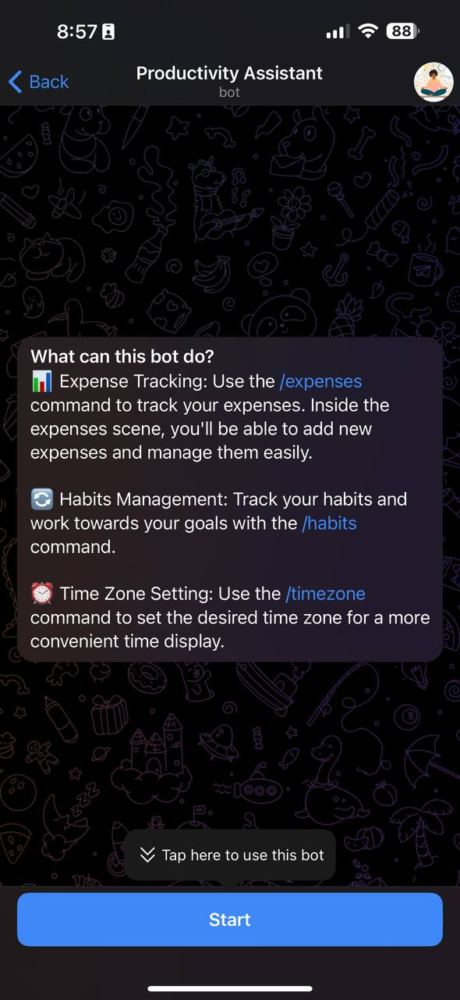

# Productivity Assistant
Productivity Assistant is a Telegram bot designed for expense and habit tracking, utilizing Notion as a database.

## Modules
### Expense Tracker
The Expense Tracker module allows users to monitor their expenses. By default, it displays expenses for the current month, but users can also view expenses for the current day, yesterday, and the previous month. The bot supports tracking expenses in Thai Baht (THB), with automatic conversion to US Dollars (USD) using the `currency-converter-lt` package, which fetches exchange rates from Google via GET requests. To add a new expense, simply input the expense in the format `title amount`, for example, `Electricity Counter 1400`, in the `/expenses` scene. The bot will prompt you to select a category. Expenses are stored in a Notion table with the following columns: **Expense, Amount THB, Amount USD, Category, and Date**. The project was developed for personal use, so customization for different currencies requires forking the repository and making the necessary changes.

### Habit Tracker
The Habit Tracker module offers a more personalized solution compared to the Expense Tracker. Users can add an unlimited number of habits. The primary task involves setting up the Notion table template with a `@Today` generic property and scheduling it to repeat daily at **12:00AM UTC**. Each day, a new entry will appear where users can mark their completed habits. The table consists of checkbox fields.

### Timezone
As I frequently travel, I wanted to receive data in my current timezone. All data is added in UTC, which facilitates timezone management. I opted not to implement location sharing via keyboard buttons due to limitations in the desktop version of Telegram. Users can specify their current timezone in the `/timezone` scene, for example, `Europe/Amsterdam`.

## Functionality Examples
You can find actual functionality examples of the bot in the [examples](examples) folder.

## Feedback and Support
If you find this implementation helpful, please consider starring this repository. For assistance with developing your own bot, feel free to contact me at [t.me/nexiq](https://t.me/nexiq "Telegram").
